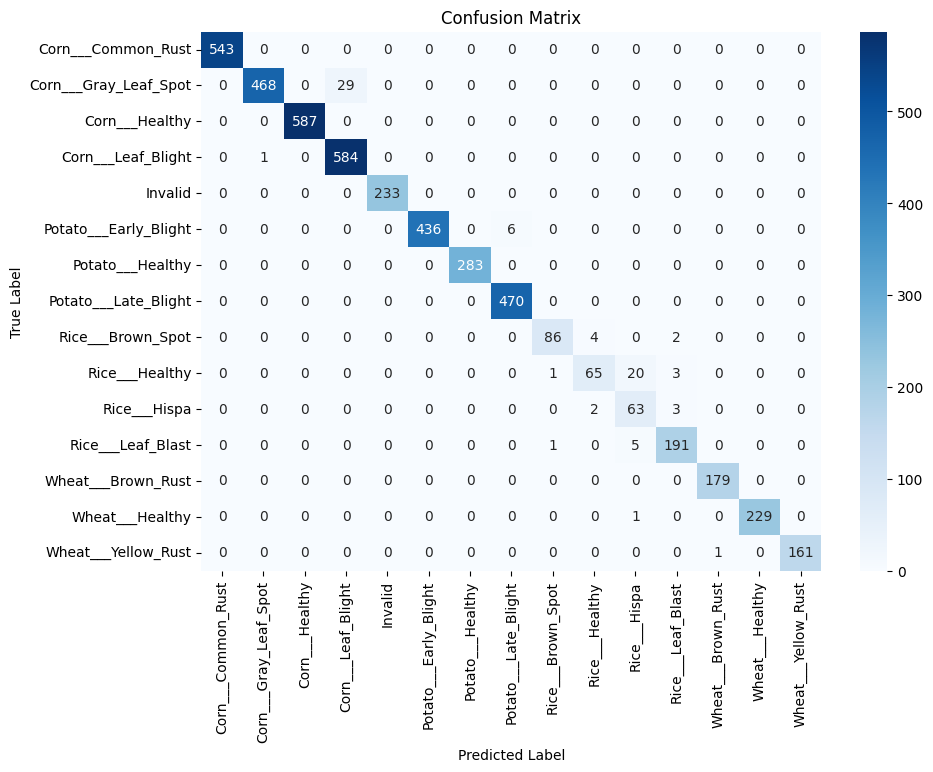

---
base_model:
- WinKawaks/vit-tiny-patch16-224
library_name: transformers
license: mit
metrics:
- accuracy
pipeline_tag: image-classification
tags:
- vision transformer
- agriculture
- plant disease detection
- smart farming
- image classification
---

# Model Card for Smart Farming Disease Detection Transformer

This model is a Vision Transformer (ViT) designed to identify plant diseases in crops as part of a smart agricultural farming system. It has been trained on a diverse dataset of plant images, including different disease categories affecting crops such as corn, potato, rice, and wheat. The model aims to provide farmers and agronomists with real-time disease detection for better crop management.

## Model Details

### Model Description

This Vision Transformer model has been fine-tuned to classify various plant diseases commonly found in agricultural settings. The model can classify diseases in crops such as corn, potato, rice, and wheat, identifying diseases like rust, blight, leaf spots, and others. The goal is to enable precision farming by helping farmers detect diseases early and take appropriate actions.

- **Developed by:** Wambugu Kinyua
- **Model type:** Vision Transformer (ViT)
- **Languages (NLP):** N/A (Computer Vision Model)
- **License:** Apache 2.0
- **Finetuned from model:** (WinKawaks/vit-tiny-patch16-224)[https://huggingface.co/WinKawaks/vit-tiny-patch16-224]
- **Input:** Images of crops (RGB format)
- **Output:** Disease classification labels (healthy or diseased categories)
## Diseases  from the  model 

| Crop   | Diseases Identified          |
|--------|------------------------------|
| Corn   | Common Rust                  |
| Corn   | Gray Leaf Spot               |
| Corn   | Healthy                      |
| Corn   | Leaf Blight                  |
| -      | Invalid                      |
| Potato | Early Blight                 |
| Potato | Healthy                      |
| Potato | Late Blight                  |
| Rice   | Brown Spot                   |
| Rice   | Healthy                      |
| Rice   | Leaf Blast                   |
| Wheat  | Brown Rust                   |
| Wheat  | Healthy                      |
| Wheat  | Yellow Rust                  |


## Uses

### Direct Use

This model can be used directly to classify images of crops to detect plant diseases. It is especially useful for precision farming, enabling users to monitor crop health and take early interventions based on the detected disease.

### Downstream Use

This model can be fine-tuned on other agricultural datasets for specific crops or regions to improve its performance or be integrated into larger precision farming systems that include other features like weather predictions and irrigation control.

Can  be  quantitized or  deployed in full precision  on edge  devices  due  to its  small parameter  size without compromising  on precision and accuracy.
### Out-of-Scope Use

This model is not designed for non-agricultural image classification tasks or for environments with insufficient or very noisy data. Misuse includes using the model in areas with vastly different agricultural conditions from those it was trained on.

## Bias, Risks, and Limitations

- The model may exhibit bias toward the crops and diseases present in the training dataset, leading to lower performance on unrepresented diseases or crop varieties.
- False negatives (failing to detect a disease) may result in untreated crop damage, while false positives could lead to unnecessary interventions.

### Recommendations

Users should evaluate the model on their specific crops and farming conditions. Regular updates and retraining with local data are recommended for optimal performance.

## How to Get Started with the Model

```python
from PIL import Image, UnidentifiedImageError
from transformers import ViTFeatureExtractor, ViTForImageClassification
feature_extractor = ViTFeatureExtractor.from_pretrained('wambugu71/crop_leaf_diseases_vit')
model = ViTForImageClassification.from_pretrained(
    'wambugu1738/crop_leaf_diseases_vit',
    ignore_mismatched_sizes=True
)
image = Image.open('<image_path>')
inputs = feature_extractor(images=image, return_tensors="pt")
outputs = model(**inputs)
logits = outputs.logits
predicted_class_idx = logits.argmax(-1).item()
print("Predicted class:", model.config.id2label[predicted_class_idx])
```

## Training Details

### Training Data

The model was trained on a dataset containing images of various crops with labeled diseases, including the following categories:

- **Corn**: Common Rust, Gray Leaf Spot, Leaf Blight, Healthy
- **Potato**: Early Blight, Late Blight, Healthy
- **Rice**: Brown Spot, Hispa, Leaf Blast, Healthy
- **Wheat**: Brown Rust, Yellow Rust, Healthy

The dataset also includes images captured under various lighting conditions, from both controlled  and  uncontrolled environments and angles, to simulate real-world farming scenarios.
We made use  of  public available  datasets, and  our  own private  data. 
### Training Procedure

The model was fine-tuned using a vision transformer architecture pre-trained on the ImageNet dataset. The dataset was preprocessed by resizing the images and normalizing the pixel values.

#### Training Hyperparameters

- **Batch size:** 32
- **Learning rate:** 2e-5
- **Epochs:** 4
- **Optimizer:** AdamW
- **Precision:** fp16

### Evaluation



#### Testing Data, Factors & Metrics

The model was evaluated using a validation set consisting of 20% of the original dataset, with the following metrics:

- **Accuracy:** 98%
- **Precision:** 97%
- **Recall:** 97%
- **F1 Score:** 96%

## Environmental Impact

Carbon emissions during model training can be estimated using the [Machine Learning Impact calculator](https://mlco2.github.io/impact#compute).

- **Hardware Type:** NVIDIA L40S
- **Hours used:** 1 hours
- **Cloud Provider:** Lightning AI

## Technical Specifications

### Model Architecture and Objective

The model uses a Vision Transformer architecture to learn image representations and classify them into disease categories. Its self-attention mechanism enables it to capture global contextual information in the images, making it suitable for agricultural disease detection.

### Compute Infrastructure

#### Hardware

- NVIDIA L40S GPUs
- 48 GB RAM
- SSD storage for fast I/O

#### Software

- Python 3.9
- PyTorch 2.4.1+cu121
- pytorch_lightning
- Transformers library by Hugging Face

## Citation

If you use this model in your research or applications, please cite it as:

**BibTeX:**

```
@misc{kinyua2024smartfarming,
  title={Smart Farming Disease Detection Transformer},
  author={Wambugu Kinyua},
  year={2024},
  publisher={Hugging Face},
}
```

**APA:**

Kinyua, W. (2024). Smart Farming Disease Detection Transformer. Hugging Face.

## Model Card Contact

For further inquiries, contact: wambugukinyua@proton.me